# Redirect Documentation

This document provides a comprehensive overview of all redirects in the application, showing where users are sent after completing various actions.

## Overview

The Awning Management System uses Flask's `redirect()` and `url_for()` functions to navigate users through the application. Understanding these redirects is crucial for maintaining good user experience and preventing users from ending up on unexpected pages.

## Redirect Principles

1. **Context-Aware**: Redirects should send users back to relevant pages
2. **Success Feedback**: Always flash a message before redirecting
3. **Error Handling**: Failed operations should redirect appropriately
4. **Referrer Support**: Use `return_url` parameters when possible

---

## Work Orders Module

### Create Work Order

**Route**: `POST /work_orders/new`

**Success Redirect**: Customer Detail Page

```python
redirect(url_for("customers.customer_detail", customer_id=work_order.CustID))
```

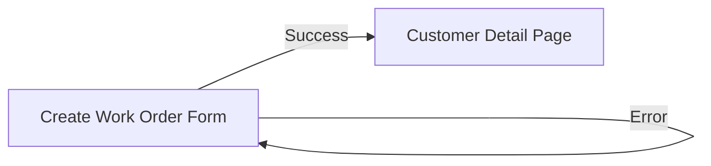

**Rationale**: After creating a work order, users want to see the customer's full context including all their orders.

---

### Edit Work Order

**Route**: `POST /work_orders/edit/<work_order_no>`

**Success Redirect**: Customer Detail Page

```python
redirect(url_for("customers.customer_detail", customer_id=work_order.CustID))
```

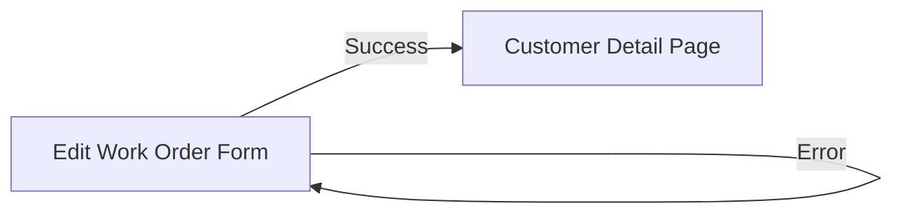

**Rationale**: Similar to create - maintains customer context after editing.

---

### Cleaning Room Edit

**Route**: `POST /work_orders/cleaning-room/edit/<work_order_no>`

**Success Redirect**: Customer Detail Page

```python
redirect(url_for("customers.customer_detail", customer_id=work_order.CustID))
```

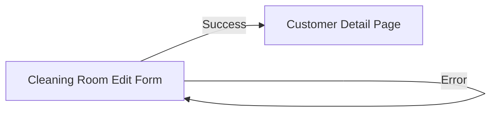

**Rationale**: Cleaning room staff need to see customer context after updating order status.

---

### Delete Work Order

**Route**: `POST /work_orders/delete/<work_order_no>`

**Current Redirect**: ⚠️ **Work Orders List Page** (Issue #163)

```python
redirect(url_for("work_orders.list_work_orders"))
```

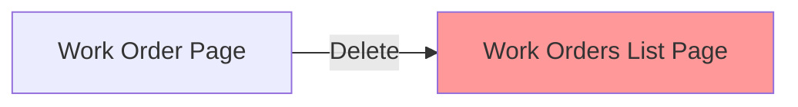

!!! warning "Known Issue"
    This redirect sends users to the work orders list page. See [Issue #163](https://github.com/andrewimpellitteri/awning_wo/issues/163) for discussion on changing this behavior.

    **Possible alternatives**:

    - Customer Detail Page
    - Dashboard
    - Previous page (referrer)
    - In-Progress Orders page

---

### PDF Generation Errors

**Route**: `GET /work_orders/<work_order_no>/pdf/download`

**Error Redirect**: Work Order Detail Page

```python
redirect(url_for("work_orders.view_work_order", work_order_no=work_order_no))
```

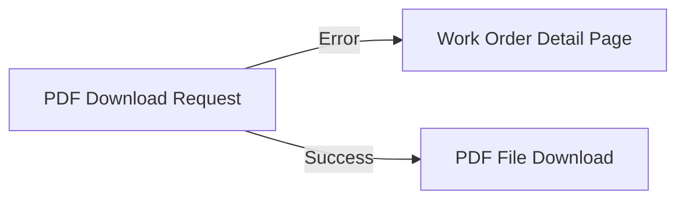

---

## Repair Orders Module

### Create Repair Order

**Route**: `POST /repair_orders/new`

**Success Redirect**: Repair Order Detail Page

```python
redirect(url_for("repair_work_orders.view_repair_work_order", repair_order_no=next_order_no))
```

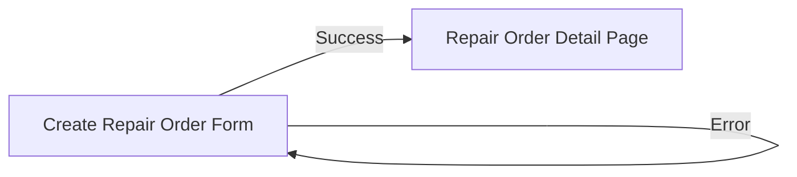

**Rationale**: Users want to immediately view the newly created repair order.

---

### Edit Repair Order

**Route**: `POST /repair_orders/edit/<repair_order_no>`

**Success Redirect**: Repair Order Detail Page

```python
redirect(url_for("repair_work_orders.view_repair_work_order", repair_order_no=repair_order_no))
```

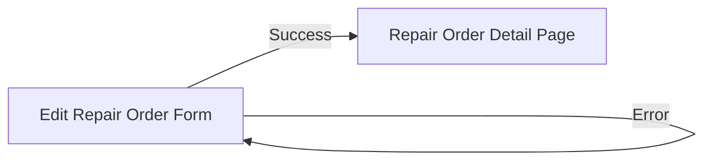

---

### Delete Repair Order

**Route**: `POST /repair_orders/delete/<repair_order_no>`

**Success Redirect**: Repair Orders List Page

```python
redirect(url_for("repair_work_orders.list_repair_work_orders"))
```

**Error Redirect**: Repair Order Detail Page

```python
redirect(url_for("repair_work_orders.view_repair_work_order", repair_order_no=repair_order_no))
```

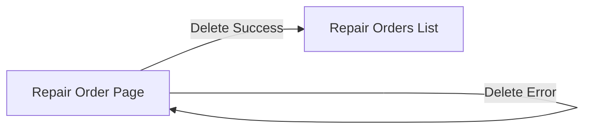

---

## Customers Module

### Create Customer

**Route**: `POST /customers/new`

**Success Redirect**: Customer Detail Page (View Mode)

```python
redirect(url_for("customers.view_customer", customer_id=customer.CustID))
```

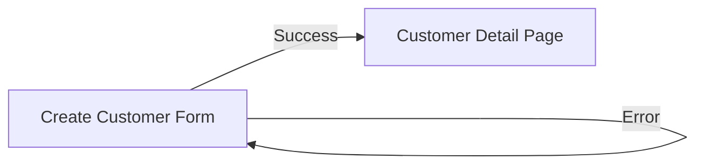

**Rationale**: After creating a customer, users typically want to view the full customer profile or add work orders.

---

### Edit Customer

**Route**: `POST /customers/edit/<customer_id>`

**Success Redirect**: Customer Detail Page

```python
redirect(url_for("customers.customer_detail", customer_id=customer.CustID))
```

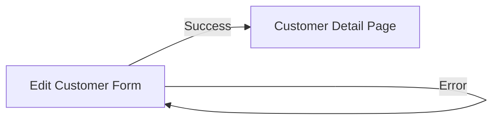

---

### Delete Customer

**Route**: `POST /customers/delete/<customer_id>`

**Success Redirect**: Customers List Page

```python
redirect(url_for("customers.list_customers"))
```

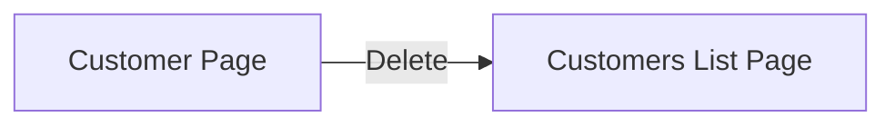

**Rationale**: After deleting a customer, the detail page no longer exists, so list view is appropriate.

---

## Inventory Module

### Create Inventory Item

**Route**: `POST /inventory/new`

**Success Redirect**: Inventory Item Detail Page

```python
redirect(url_for("inventory.inventory_detail", inventory_key=inventory_key))
```

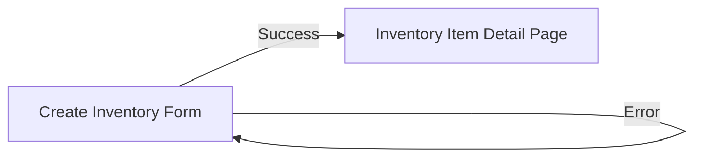

---

### Edit Inventory Item

**Route**: `POST /inventory/edit/<inventory_key>`

**Success Redirect**: Inventory Item Detail Page

```python
redirect(url_for("inventory.inventory_detail", inventory_key=inventory_key))
```

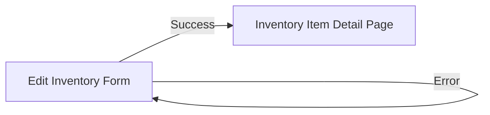

---

### Delete Inventory Item

**Route**: `POST /inventory/delete/<inventory_key>`

**Success Redirect**: Inventory List Page

```python
redirect(url_for("inventory.inventory_list"))
```

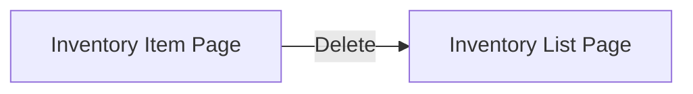

---

## Sources Module

### Create Source

**Route**: `POST /sources/new`

**Success Redirect**: Source Detail Page

```python
redirect(url_for("source.source_detail", source_name=source.SSource))
```


---

### Edit Source

**Route**: `POST /sources/edit/<source_name>`

**Success Redirect**: Source Detail Page

```python
redirect(url_for("source.source_detail", source_name=source.SSource))
```

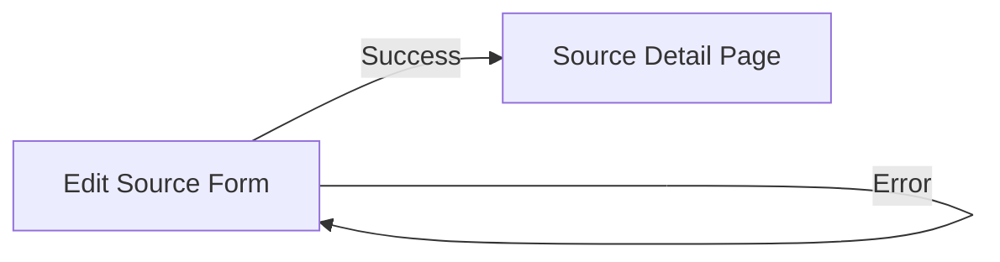

---

### Delete Source

**Route**: `POST /sources/delete/<source_name>`

**Success Redirect**: Sources List Page

```python
redirect(url_for("source.source_list"))
```

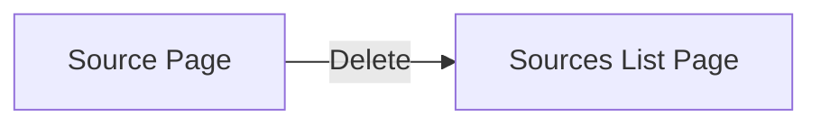

---

## Authentication Module

### Login

**Route**: `POST /auth/login`

**Success Redirect**: Dashboard

```python
redirect(url_for("dashboard"))
```

**Already Logged In**: Dashboard

```python
redirect(url_for("dashboard"))
```

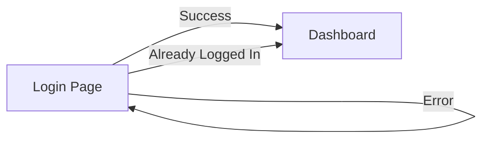

---

### Logout

**Route**: `GET /auth/logout`

**Redirect**: Login Page

```python
redirect(url_for("auth.login"))
```

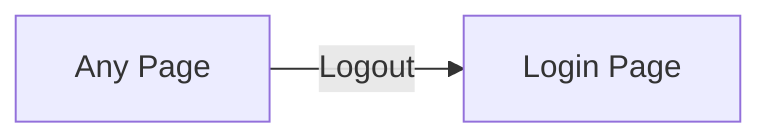

---

### Register

**Route**: `POST /auth/register`

**Success Redirect**: Login Page

```python
redirect(url_for("auth.login"))
```

**Error Redirects**: Registration Page (various validation errors)

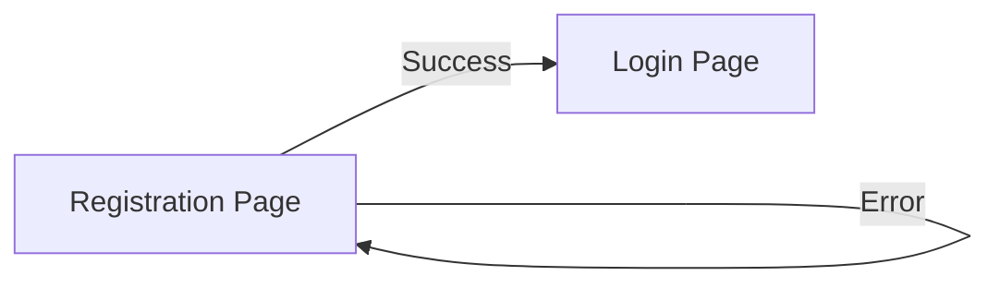

---

## Admin Module

### Create User

**Route**: `POST /admin/users/create`

**Redirect**: Manage Users Page

```python
redirect(url_for("admin.manage_users"))
```

---

### Delete User

**Route**: `POST /admin/users/delete/<user_id>`

**Redirect**: Manage Users Page

```python
redirect(url_for("admin.manage_users"))
```

---

### Toggle Admin

**Route**: `POST /admin/users/toggle_admin/<user_id>`

**Redirect**: Manage Users Page

```python
redirect(url_for("admin.manage_users"))
```

```mermaid
graph LR
    A[Manage Users Page] -->|Any Admin Action| A
```

**Rationale**: Admin stays on user management page to perform multiple actions.

---

## In-Progress Module

### Root Route

**Route**: `GET /in_progress/`

**Redirect**: All Recent Orders

```python
redirect(url_for("in_progress.all_recent"))
```

```mermaid
graph LR
    A[/in_progress/] -->|Auto-redirect| B[/in_progress/all_recent]
```

---

## File Downloads

### Work Order Files

**Route**: `GET /work_orders/<work_order_no>/files/<file_id>/download`

**S3 Files**: Pre-signed URL Redirect

```python
redirect(presigned_url)
```

**Local Files**: Direct file download (no redirect)

---

### Thumbnails

**Route**: `GET /work_orders/thumbnail/<file_id>`

**S3 Thumbnails**: Pre-signed URL Redirect

```python
redirect(thumbnail_url)
```

**Local Thumbnails**: Direct file download (no redirect)

---

## Return URL Pattern

Several routes support a `return_url` query parameter for flexible navigation:

### Work Order Detail

```python
return_url = request.args.get(
    "return_url", request.referrer or url_for("work_orders.list_work_orders")
)
```

### Work Order Edit

```python
return_url = request.args.get(
    "return_url", request.referrer or url_for("work_orders.list_work_orders")
)
```

### Cleaning Room Edit

```python
return_url = request.args.get(
    "return_url", request.referrer or url_for("work_orders.list_work_orders")
)
```

!!! tip "Using Return URLs"
    When linking to these pages, you can specify where the user should return:

    ```html
    <a href="{{ url_for('work_orders.view_work_order',
                        work_order_no=wo.WorkOrderNo,
                        return_url=url_for('queue.cleaning_queue')) }}">
        View Order
    </a>
    ```

---

## Complete Redirect Flow Diagram

```mermaid
graph TB
    Dashboard[Dashboard]

    %% Work Orders
    WOList[Work Orders List]
    WODetail[Work Order Detail]
    WOCreate[Create Work Order]
    WOEdit[Edit Work Order]
    CleanEdit[Cleaning Room Edit]

    %% Customers
    CustList[Customers List]
    CustDetail[Customer Detail]
    CustCreate[Create Customer]
    CustEdit[Edit Customer]

    %% Repair Orders
    ROList[Repair Orders List]
    RODetail[Repair Order Detail]
    ROCreate[Create Repair Order]
    ROEdit[Edit Repair Order]

    %% Auth
    Login[Login Page]

    %% Work Order flows
    WOCreate -->|Success| CustDetail
    WOEdit -->|Success| CustDetail
    CleanEdit -->|Success| CustDetail
    WODetail -->|Delete| WOList

    %% Customer flows
    CustCreate -->|Success| CustDetail
    CustEdit -->|Success| CustDetail
    CustDetail -->|Delete| CustList

    %% Repair Order flows
    ROCreate -->|Success| RODetail
    ROEdit -->|Success| RODetail
    RODetail -->|Delete| ROList

    %% Auth flows
    Login -->|Success| Dashboard
    Dashboard -->|Logout| Login

    %% Issue highlight
    style WOList fill:#ff9999

    classDef issueNode fill:#ff9999,stroke:#ff0000,stroke-width:2px
    classDef normalNode fill:#9999ff,stroke:#0000ff,stroke-width:2px
```

---

## Known Issues

### Issue #163: Work Order Delete Redirect

**Current Behavior**: Deleting a work order redirects to the Work Orders List page.

**Location**: [routes/work_orders.py:1124](https://github.com/andrewimpellitteri/awning_wo/blob/main/routes/work_orders.py#L1124)

**Discussion**: [GitHub Issue #163](https://github.com/andrewimpellitteri/awning_wo/issues/163)

**Proposed Solutions**:

1. Redirect to Customer Detail page (maintains customer context)
2. Redirect to Dashboard (neutral location)
3. Redirect to previous page using referrer (most flexible)
4. Redirect to In-Progress or Queue page (workflow-oriented)

---

## Best Practices

### When Adding New Redirects

1. **Consider User Context**: Where did they come from? What's their next likely action?
2. **Use return_url Parameters**: Allow flexible navigation when appropriate
3. **Flash Messages**: Always provide feedback before redirecting
4. **Error Handling**: Redirect to safe pages on errors
5. **Avoid List Pages**: After creating/editing, redirect to detail pages when possible
6. **Document Changes**: Update this guide when modifying redirects

### Common Patterns

#### After Create Operations

```python
# Good: Show the newly created item
return redirect(url_for("module.detail_view", id=new_item.id))
```

#### After Edit Operations

```python
# Good: Stay on detail page or return to context
return redirect(url_for("module.detail_view", id=item.id))
```

#### After Delete Operations

```python
# Good: List page (detail page no longer exists)
return redirect(url_for("module.list_view"))
```

#### With Return URL Support

```python
# Good: Flexible navigation
return_url = request.args.get("return_url", request.referrer or url_for("module.default_view"))
return redirect(return_url)
```

---

## Testing Redirects

When testing redirect logic:

1. **Test all paths**: success, error, edge cases
2. **Verify flash messages**: ensure proper user feedback
3. **Check HTTP status codes**: should be 302 (Found) or 303 (See Other)
4. **Test return_url parameters**: ensure they work correctly
5. **Verify authentication redirects**: unauthenticated users handled properly

Example test:

```python
def test_delete_work_order_redirect(client, auth_login):
    """Test that deleting a work order redirects appropriately"""
    response = client.post('/work_orders/delete/12345', follow_redirects=False)
    assert response.status_code == 302
    assert '/work_orders/' in response.location
```

---

## Changelog

| Date | Change | Issue |
|------|--------|-------|
| 2025-10-20 | Initial redirect documentation created | - |
| 2025-10-20 | Identified work order delete redirect issue | #163 |

---

## See Also

- [Flask URL Building](https://flask.palletsprojects.com/en/2.3.x/quickstart/#url-building)
- [Flask Redirects](https://flask.palletsprojects.com/en/2.3.x/quickstart/#redirects-and-errors)
- [Flask Message Flashing](https://flask.palletsprojects.com/en/2.3.x/patterns/flashing/)
